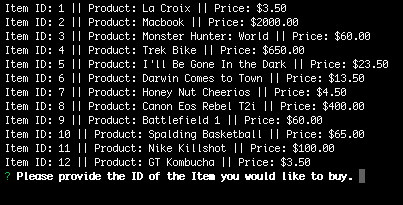

# MySQL-Amazon

## Description

This application is a command line based storefront that utilizes MySQL database as well as the mysql npm and inquirer npm packages. 

## Customer Interface

As a customer, you can choose from a list of items by submitting the items ID and the quantity of the item you wish to buy. If the item is in stock and there is a sufficient quantity, the user shown the total amount.

